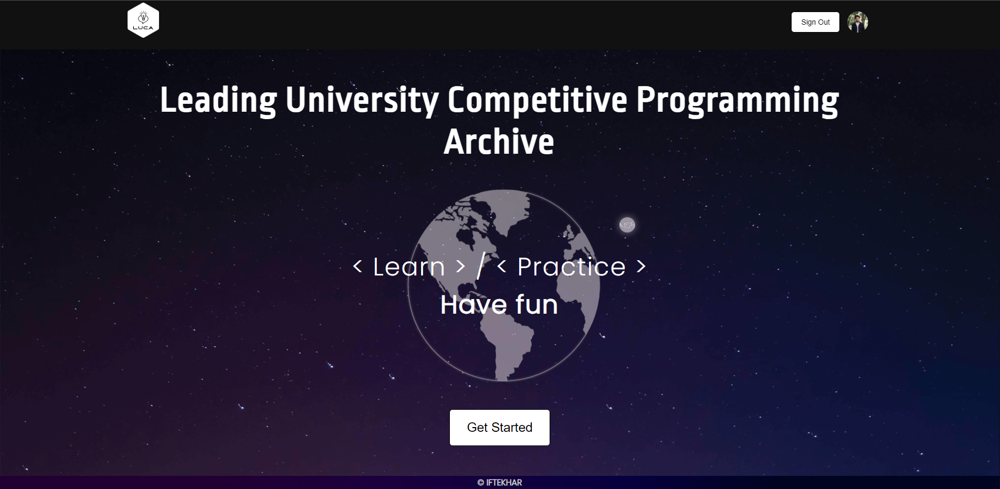
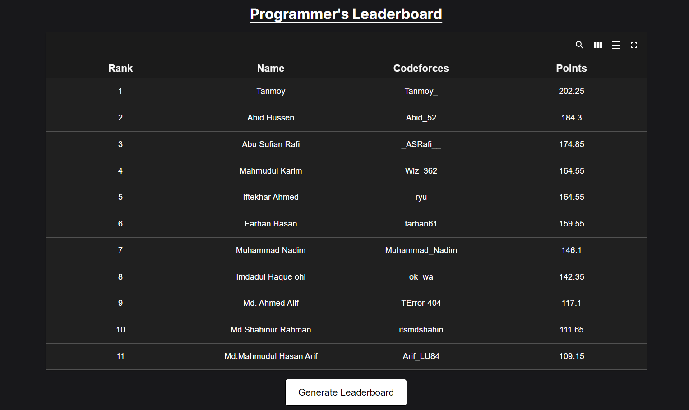
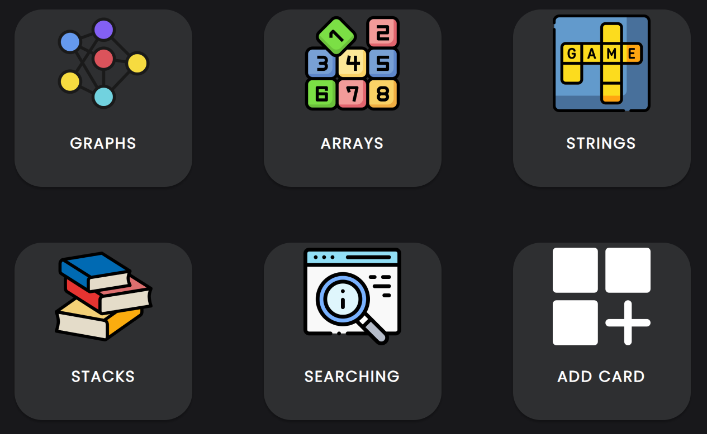
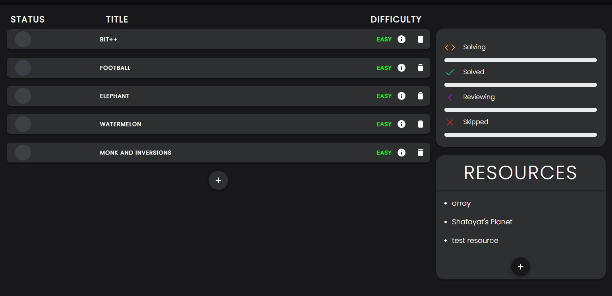
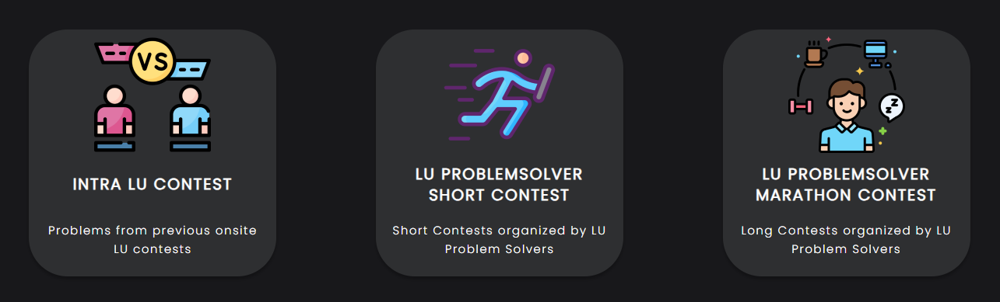
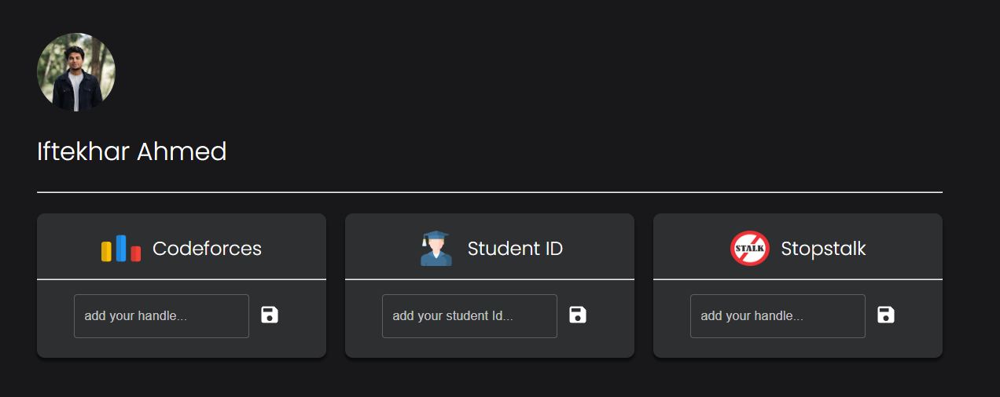
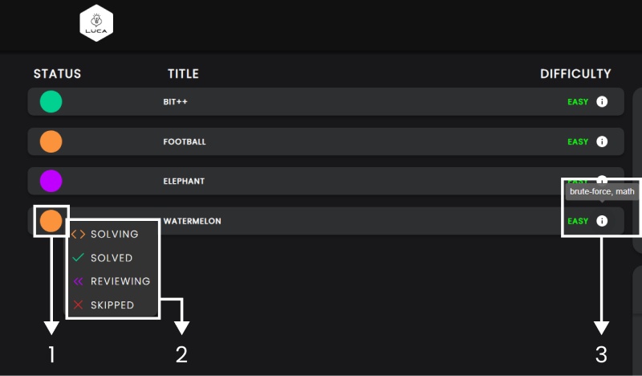
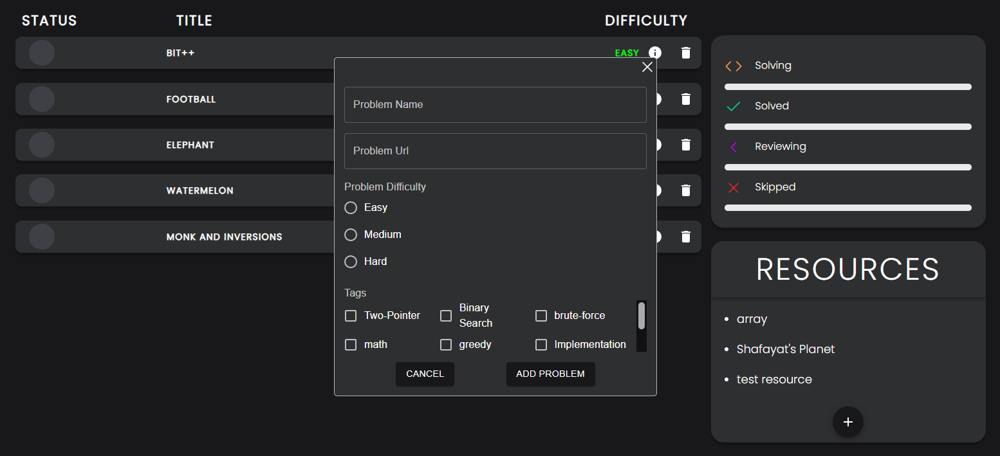
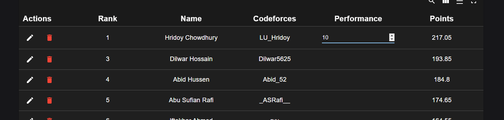

# Leading University Competitive Programming Archive

## Introduction

LU-CP-Archive is an application aimed to aid students who are competing in programming competitions. The volume of problems provided by all the competitive programming sites overwhelms the students. This platform tries to make their life a bit easier.

## Features

### Leaderboard

The leaderboard is generated based on the programmer’s codeforces rating, problem solved above his/her rating (in the last month), problem solved equal to or below his/her rating (in the last month), and total contest participation (in the last month)

### Topic Wise Problem Solving

Students can solve topic-wise problems which are hand-picked by the LU-ACM community

## Codeforces Ladder

Each codeforces ladder contains 50 problems which are solved by the 5 all-time top LU CP programmers.

### Upcoming Contest

Programmers can also track the upcoming contest from Codeforces, Codechef, and Atcoder

### Other Contests

## User Guide

### Regular Users / Programmers:

-   Programmers can add their codeforces user handle, student id, and stopstalk id in their profile section after creating their account
    
    _NB: programmer must add their codeforces handle in order to be featured in the Leaderboard_

-   After adding the codeforces account he/she will be able to see his/her solved problem in the codeforces ladder section
    

-   In the topic-wise problem section,
    
    -   1. The colored circle indicates the problem status. Orange implies it is under the process of you solving it. Green means the problem has been solved. Purple indicates you are reviewing the problem at hand. Lastly, red suggests that you've skipped the problem.
    -   2. If there is any problem you want the status to be changed, just click on the circle and a menu will pop up. From here you can change the problem status manually. It is a handy feature to keep track of the problems you solve.
    -   3. The problem difficulty is shown here along with the tags. To see what category any particular problem belongs to, just hover your mouse on the (ℹ).

### Admin

-   Admin can Add/Remove Topic wise problems ( problem, problem difficulty, related tags, etc... ) and resources
    

-   Admin can also add a new topic
    

-   Admin can also add new problems to each codeforces ladder, Intra LU Contest, LU Short Contest, and LU Marathon Contest.

-   Admin can Generate and save the leaderboard, and also make additional changes to the leaderboard
    
