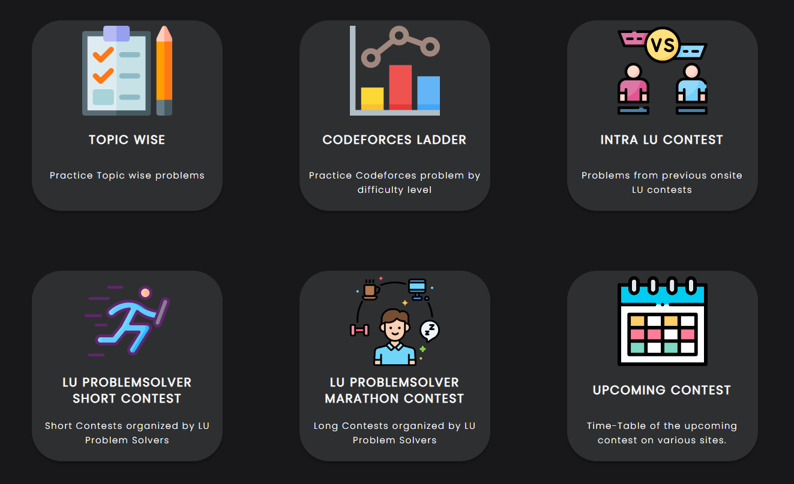
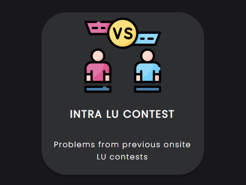
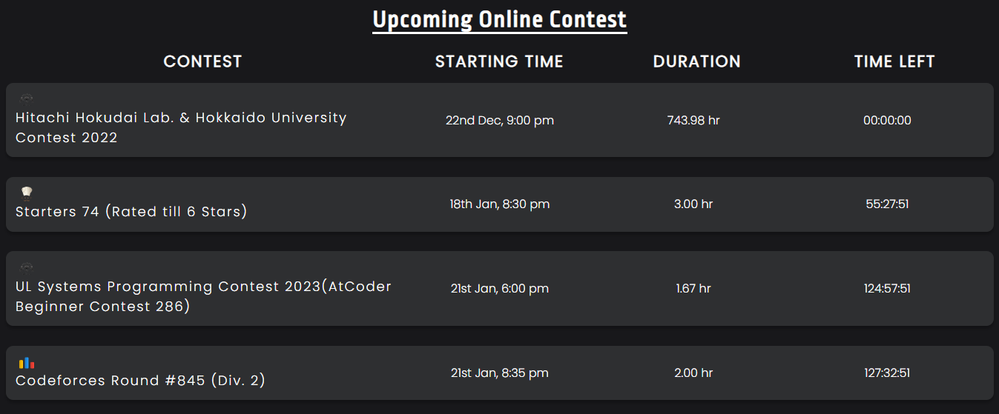
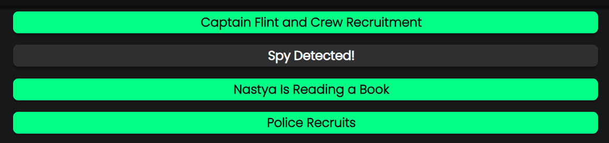

# LU-CP-Archive

LU-CP-Archive is a **MERN** stack application aimed to aid students who are competing in programming competitions. The volume of problems provided by all the competitive programming sites overwhelms the students. So I built a web application where users can get/add:

-   Topic-wise problems
    

-   Previous Inter/Intra programming contest problems
    

-   Codeforces ladder from 800-2500 (each ladder contains the top 50 questions solved by LU's top programmer)
    

-   Upcoming online contests timetable, etc.
    

Also, It is connected to Codeforces API so one can see his solved and unsolved questions.

## User Guide

